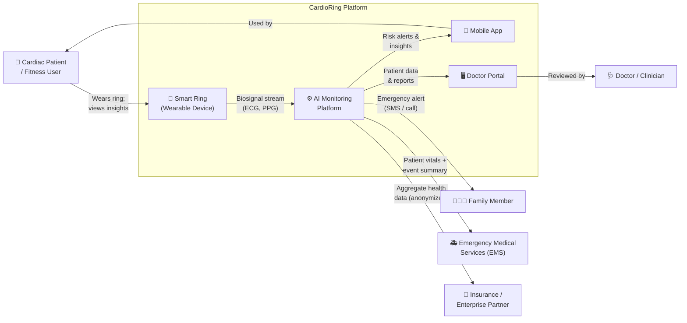
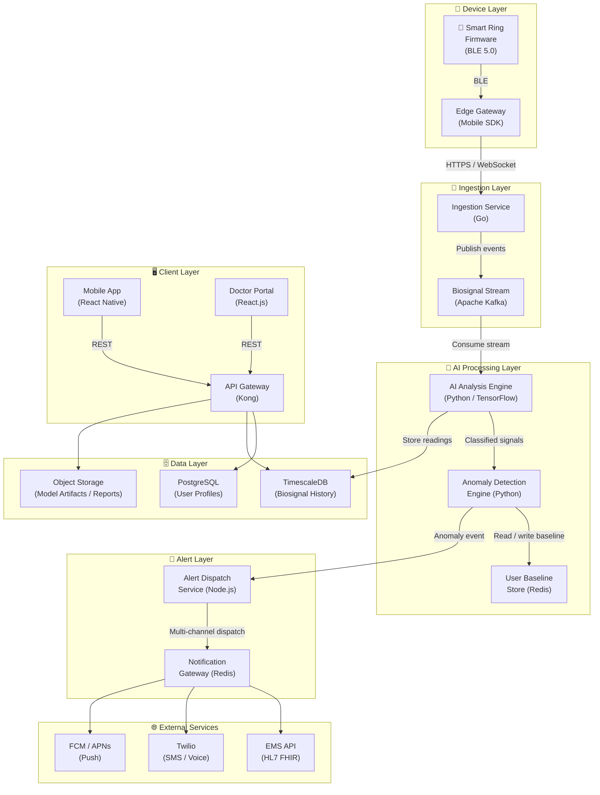
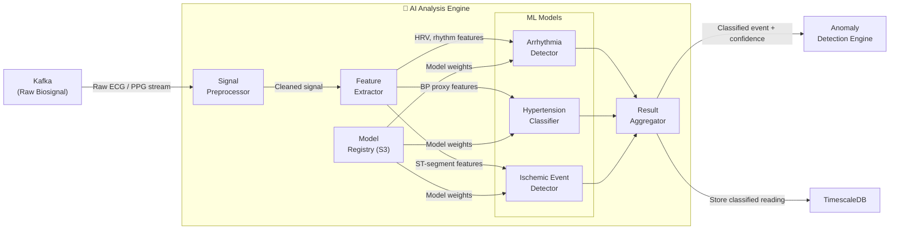
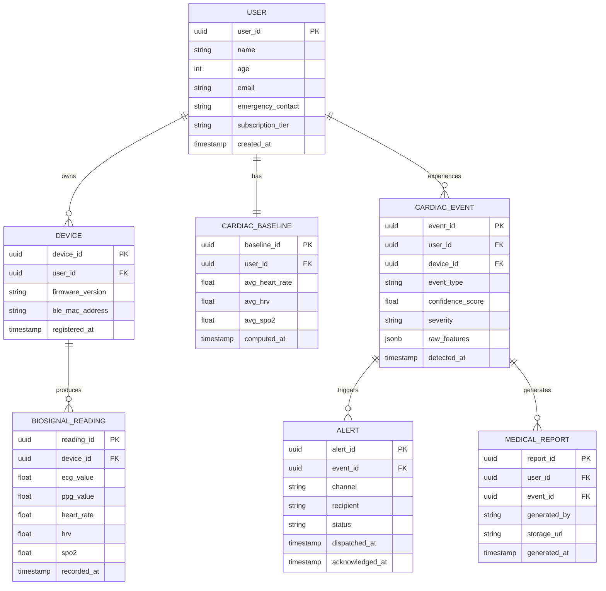
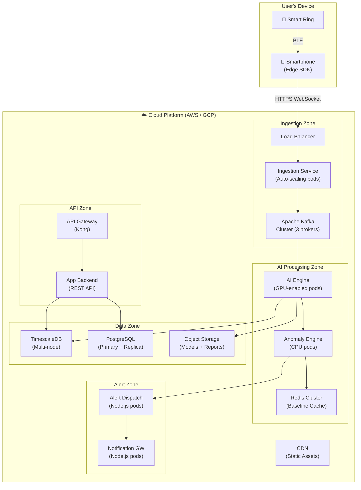

# Architecture Document: AI-Powered Smart Ring for Early Cardiac Arrest Detection

> **Status:** Draft  
> **Date:** April 08, 2026  
> **Author:** System Architect  
> **Version:** 1.0

> **Implementation Note:** For implementation-accurate anomaly formulas, severity thresholds, and operational flow in this repository, see [Docs/project-technical-deep-dive.md](Docs/project-technical-deep-dive.md).

---

## Table of Contents

1. [Architecture Brief](#1-architecture-brief)
2. [System Context (C4 Level 1)](#2-system-context-c4-level-1)
3. [Container Diagram (C4 Level 2)](#3-container-diagram-c4-level-2)
4. [Component Diagram — AI Analysis Engine](#4-component-diagram--ai-analysis-engine)
5. [Sequence Diagram — Cardiac Event Detection Flow](#5-sequence-diagram--cardiac-event-detection-flow)
6. [Data Model](#6-data-model)
7. [Deployment Architecture](#7-deployment-architecture)
8. [Architecture Decision Records (ADRs)](#8-architecture-decision-records-adrs)

---

## 1. Architecture Brief

### System Context

| Field | Detail |
|---|---|
| **One-sentence purpose** | A wearable smart ring that continuously monitors cardiac biosignals, applies real-time AI analysis to detect early signs of cardiac arrest, and dispatches automated emergency alerts to users, families, and medical facilities within 30 seconds of anomaly detection. |
| **Primary users** | Adults aged 35+ with pre-existing cardiac risk (patients), fitness enthusiasts, hospital & clinic partners, and emergency medical services (EMS). |
| **Critical workflow** | Biosignal acquisition → AI anomaly detection → multi-channel alert dispatch — this pipeline must never fail silently. |

---

### Scale Targets

| Stage | Users | Throughput |
|---|---|---|
| **Launch** | ~100,000 active devices | ~500 biosignal streams/sec |
| **Scale Target** | 1 Million subscription + free-tier users | ~5,000 biosignal streams/sec |
| **Scale Strategy** | Scale-out (horizontal microservices) with regional edge processing |

---

### Quality Attribute Priority Stack

| Priority | Attribute | Architectural Implication |
|---|---|---|
| 1 | **Reliability** | Alert dispatch must be fault-tolerant; no single point of failure |
| 2 | **Low Latency** | End-to-end alert must be dispatched in < 30 seconds of anomaly |
| 3 | **Security & Compliance** | All health data subject to HIPAA / patient data privacy regulations |
| 4 | **Accuracy** | AI detection model must achieve ≥ 99.5% accuracy with minimal false positives |
| 5 | **Availability** | 99.9% uptime SLA for the alert pipeline; 99.5% for the mobile app |
| 6 | **Scalability** | Must handle 1M+ devices without architectural re-design |

---

### Architectural Style

| | |
|---|---|
| **Selected** | Event-Driven Microservices with Edge Processing |
| **Rationale** | Real-time biosignal streams demand asynchronous event pipelines; microservices allow the AI engine, alert dispatcher, and user app to scale and fail independently. |
| **Explicitly Rejected** | Monolith — insufficient fault isolation; a crash in one module could silence life-critical alerts |
| **Explicitly Rejected** | Pure serverless — cold start latency is incompatible with < 30-second alert SLA |

---

### Components (High Level)

| Component | Responsibility | Technology |
|---|---|---|
| **Smart Ring Firmware** | Biosignal acquisition (ECG, PPG, biosensors); BLE/WiFi transmission | Embedded C, BLE 5.0 |
| **Edge Gateway** | On-device or paired-phone pre-processing; reduces cloud bandwidth | React Native / iOS & Android SDK |
| **Biosignal Ingestion Service** | Receives raw streams from all active rings; buffers and routes to AI engine | Kafka + Go microservice |
| **AI Analysis Engine** | Real-time arrhythmia, hypertension & ischemic event detection | Python, TensorFlow / PyTorch |
| **Anomaly Detection Engine** | Compares results against per-user baseline; classifies severity | Python microservice |
| **Alert Dispatch Service** | Sends alerts to user ring (buzz), mobile app, family contacts, EMS | Node.js, Twilio/SMS, Push Notifications, EMS API |
| **Patient Data Store** | Stores historical cardiac metrics, user profiles, baselines | PostgreSQL (relational) + TimescaleDB (time-series) |
| **Mobile Application** | Personalized dashboard, health insights, lifestyle guidance | React Native |
| **Doctor Portal** | Secure physician dashboard for remote patient monitoring | React.js |
| **Notification Gateway** | Aggregates multi-channel alerts (SMS, push, EMS webhook) | Node.js + Redis |
| **API Gateway** | Unified entry point for mobile app, doctor portal, and partner APIs | Kong / AWS API Gateway |

---

### Integration Map

| External System | Data Flow | Protocol |
|---|---|---|
| **Emergency Medical Services (EMS)** | Outbound: patient vitals, location, cardiac event summary | REST Webhook / HL7 FHIR |
| **Hospital / Clinic Systems** | Bidirectional: patient enrollment, historical data sync | HL7 FHIR / REST API |
| **SMS / Voice Gateway (Twilio)** | Outbound: family emergency alerts | REST API |
| **Mobile Push (FCM / APNs)** | Outbound: real-time risk alerts to user app | FCM SDK / APNs |
| **Insurance Company APIs** | Outbound: anonymized aggregate data for enterprise subscriptions | REST API (OAuth 2.0) |

---

## 2. System Context (C4 Level 1)

*Answers: Where does this system sit in the world and who/what interacts with it?*



**Reading guide:** The Smart Ring is the data source — it streams raw biosignals into the AI Monitoring Platform, which is the system's core. All outbound interactions (alerts, reports, portals) originate from the platform. The wearable and the mobile app together form the patient-facing experience.

**Key decisions visible here:** EMS integration is a first-class external dependency, not an afterthought. The doctor portal is a separate channel from the patient mobile app — this reflects different data-access needs and compliance boundaries.

---

## 3. Container Diagram (C4 Level 2)

*Answers: What are the deployable units and how do they communicate?*



**Reading guide:** Data flows left-to-right and top-to-bottom: from ring → ingestion → AI → alerts and storage → client apps. The Kafka bus decouples ingestion from AI processing, ensuring signal data is never lost if the AI engine is temporarily overloaded.

**Key decisions visible here:** TimescaleDB is used for time-series biosignal history (optimized for high-frequency cardiac readings), while PostgreSQL handles relational user profiles. Redis caches per-user baselines so the anomaly engine avoids expensive DB reads on every heartbeat.

---

## 4. Component Diagram — AI Analysis Engine

*Answers: What are the internal modules of the AI Analysis Engine and how do they collaborate?*



**Reading guide:** Every biosignal frame passes through preprocessing and feature extraction before being scored by three independent, condition-specific ML models. The aggregator fuses their outputs into a single classified event with confidence score before forwarding downstream.

**Key decisions visible here:** Three separate models (arrhythmia, hypertension, ischemic) rather than one monolithic model — this allows independent retraining and versioning per condition without redeploying the entire AI engine. The Model Registry (S3) enables hot-swappable model updates without service downtime.

---

## 5. Sequence Diagram — Cardiac Event Detection Flow

*Answers: How does a full cardiac event — from ring sensor to EMS dispatch — execute step by step?*

```mermaid
sequenceDiagram
    participant Ring as 💍 Smart Ring
    participant SDK as Edge SDK (Phone)
    participant Ingest as Ingestion Service
    participant Kafka as Kafka Bus
    participant AI as AI Engine
    participant Anomaly as Anomaly Engine
    participant Alert as Alert Dispatch
    participant Notif as Notification GW
    participant App as Mobile App
    participant EMS as EMS / Hospital
    participant Family as Family Contact

    Ring->>SDK: BLE stream (ECG, PPG, biosensor)
    SDK->>Ingest: HTTPS WebSocket (compressed frames)
    Ingest->>Kafka: Publish biosignal event
    Kafka->>AI: Consume biosignal batch
    AI->>AI: Preprocess + feature extraction
    AI->>AI: Run arrhythmia / hypertension / ischemic models
    AI->>Anomaly: Send classified result + confidence score
    Anomaly->>Anomaly: Compare vs. user personal baseline
    alt Anomaly Detected (high severity)
        Anomaly->>Alert: Dispatch cardiac alert event
        Alert->>Ring: Electrical buzz alert (BLE command)
        Alert->>Notif: Trigger multi-channel dispatch
        Notif->>App: Push notification (< 5s)
        Notif->>Family: SMS alert via Twilio
        Notif->>EMS: HL7 FHIR payload (vitals + location + history)
        EMS-->>Alert: ACK (EMS dispatched)
    else Normal Reading
        Anomaly->>AI: No action; update rolling baseline
    end
```

**Reading guide:** The critical path — ring to EMS — must complete within 30 seconds. The entire path from Ingestion through AI to Alert Dispatch is asynchronous via Kafka, preventing any single slow component from blocking the others. EMS receives a structured HL7 FHIR payload including the patient's current vitals, GPS location, and relevant cardiac history — enabling pre-hospital triage before arrival.

**Key decisions visible here:** The electrical buzz on the ring is dispatched in parallel with (not after) the EMS notification, ensuring the user is immediately aware even if app connectivity is poor.

---

## 6. Data Model

*Answers: What are the core data entities and how are they related?*



**Reading guide:** The `CARDIAC_BASELINE` table is a materialized, rolling summary of a user's normal metrics — this is what the Anomaly Engine compares against in real time. Raw biosignal readings land in TimescaleDB (partitioned by time); structured events and users live in PostgreSQL for relational querying.

---

## 7. Deployment Architecture

*Answers: What runs where in production?*



**Reading guide:** The deployment is separated into four zones — Ingestion, AI Processing, Alert Dispatch, and Data — each with independent scaling policies. GPU-enabled pods power the AI engine, while cheaper CPU pods handle the rest. The Alert Zone is intentionally isolated so it can scale and failover independently of the AI zone.

---

## 8. Architecture Decision Records (ADRs)

---

### ADR-001: Event-Driven Architecture via Apache Kafka

| Field | Detail |
|---|---|
| **Status** | Accepted |
| **Date** | April 2026 |

**Context:** The system must process continuous biosignal streams from 1M+ devices simultaneously, with multiple downstream consumers (AI engine, storage, monitoring). A synchronous request-response approach would create tight coupling and create back-pressure that could delay or drop critical cardiac signals.

**Decision:** We will use Apache Kafka as the central message bus between the Ingestion Service and all downstream processing consumers.

**Rationale:** Kafka's persistent, partitioned log enables multiple consumers to process the same biosignal stream independently and at their own pace — the AI engine, the time-series store, and monitoring can all consume without coupling. Replay capability enables re-processing streams with retrained models.

**Alternatives Considered:**
- **RabbitMQ** — rejected; lacks log persistence and replay capability required for model retraining workflows
- **Direct REST calls** — rejected; synchronous coupling is incompatible with the < 30-second SLA under load

**Consequences:** Adds operational complexity (Kafka cluster management). Team requires Kafka expertise. Enables future real-time ML feature pipelines without architecture changes.

---

### ADR-002: Separate ML Models per Cardiac Condition

| Field | Detail |
|---|---|
| **Status** | Accepted |
| **Date** | April 2026 |

**Context:** The AI engine must detect three distinct cardiac conditions — arrhythmia, hypertension, and ischemic events — each with different signal features, training datasets, and retraining cadences.

**Decision:** We will train and deploy three independent ML models (arrhythmia detector, hypertension classifier, ischemic event detector), each versioned separately in the Model Registry.

**Rationale:** Independent models allow the cardiologist team to retrain and update a single condition's model (e.g., improve ischemia detection after new labeled data arrives) without redeploying or risking regression in the other models. Matches real clinical specialization.

**Alternatives Considered:**
- **Single multi-label model** — rejected; retraining one condition forces revalidation of all conditions, slowing iteration
- **Ensemble of identical architectures** — rejected; different conditions have fundamentally different input feature sets

**Consequences:** Higher model management overhead (three versioned artifacts instead of one). Aggregation logic in the Result Aggregator must handle conflicting or simultaneous signals from multiple models.

---

### ADR-003: TimescaleDB for Biosignal Time-Series Storage

| Field | Detail |
|---|---|
| **Status** | Accepted |
| **Date** | April 2026 |

**Context:** The platform stores continuous biosignal readings (ECG, PPG, HR, HRV) from 1M+ devices. Queries are primarily time-range based (e.g., "last 30 days of HRV for user X"). Write throughput is very high; read patterns are append-heavy with occasional bulk historical queries.

**Decision:** We will use TimescaleDB (PostgreSQL extension) as the primary store for all raw and classified biosignal readings.

**Rationale:** TimescaleDB's automatic time-based partitioning (hypertables) delivers orders-of-magnitude better query performance over plain PostgreSQL for time-range queries. It retains SQL compatibility, allowing the same ORM and query patterns used in the relational schema.

**Alternatives Considered:**
- **InfluxDB** — rejected; proprietary query language increases onboarding cost; weaker relational join support
- **Plain PostgreSQL** — rejected; unpartitioned time-series tables degrade severely at the projected write volume
- **Apache Cassandra** — rejected; eventual consistency model conflicts with HIPAA audit trail requirements

**Consequences:** Operations team must manage TimescaleDB-specific features (compression policies, retention policies). Continuous aggregates must be defined for dashboard queries to avoid full table scans.

---

### ADR-004: HIPAA-Compliant Data Handling

| Field | Detail |
|---|---|
| **Status** | Accepted |
| **Date** | April 2026 |

**Context:** All biosignal data, cardiac event records, and patient profiles constitute Protected Health Information (PHI) under HIPAA. Unauthorized access, data leaks, or non-compliant data sharing expose the company to significant legal and financial liability.

**Decision:** We will enforce HIPAA compliance through: AES-256 encryption at rest, TLS 1.3 in transit, role-based access control on all PHI, full audit logging of all data access events, and signed Business Associate Agreements (BAAs) with all cloud vendors and third-party processors.

**Rationale:** Regulatory non-compliance is not a tolerable risk for a medical-adjacent product. HIPAA baseline is the minimum; future FDA medical device classification may impose additional requirements.

**Alternatives Considered:**
- **GDPR-only compliance** — rejected; the primary market includes the US where HIPAA applies; GDPR alone is insufficient
- **Anonymization-first architecture** — rejected as primary strategy; real-time emergency alerting requires linking events to specific identified patients and EMS dispatch locations

**Consequences:** All new features must pass a HIPAA impact assessment before deployment. Cloud vendor selection is constrained to HIPAA BAA-eligible providers (AWS, GCP, Azure). Audit logging adds a small but non-trivial storage overhead.

---

## Appendix: Key Metrics & SLAs

| Metric | Target | Current |
|---|---|---|
| Detection Accuracy | ≥ 99.5% | 99.5% |
| Alert Response Time | < 30 seconds | < 30s |
| User Retention (1 year) | ≥ 90% | 92% |
| Total Users (Subscription + Free) | 1M+ | 1 Million |
| System Uptime (Alert Pipeline) | 99.9% | — |
| Data Encryption Standard | AES-256 at rest, TLS 1.3 in transit | — |

---

*This document should be reviewed and updated with each major release. All ADRs are living records — supersede rather than delete when decisions change.*
