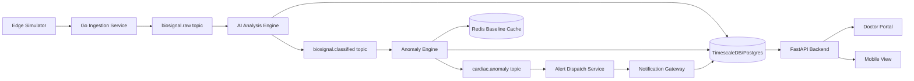

# Smart Ring Cardiac Detection: Technical Deep Dive

## 1. What this project is

This project is a runnable, event-driven cardiac monitoring demo that simulates wearable biosignal streams and detects potentially dangerous cardiac patterns in near real time.

It is designed to show the full chain:

1. Signal generation and ingestion
2. Risk scoring for multiple cardiac conditions
3. Baseline-aware anomaly detection
4. Alert routing across multiple channels
5. Doctor and patient-facing visibility

## 2. Who anomaly detection is for

Anomaly detection is applied per patient stream, not to one global population model.

- High and medium risk profiles: Expected to produce more anomaly events over time.
- Stable low-risk profiles: Expected to produce mostly normal readings and fewer or no anomaly events unless signals cross thresholds.
- Multi-patient behavior: Every patient is processed independently with their own baseline trend.

In this demo, seeded profiles include:

- Arrhythmia-focused patients
- Hypertension-focused patients
- Ischemia-focused patients
- Stable low-risk patients

## 3. End-to-end architecture (implemented flow)

## 4. How anomaly detection works

Anomaly detection is a two-stage process:

1. Stage A: Condition score computation (AI Analysis Engine)
2. Stage B: Severity evaluation with patient baseline context (Anomaly Engine)

### 4.1 Stage A: Condition score computation

For each reading, the AI Analysis Engine computes three normalized scores in the range [0, 1]:

- arrhythmia_score
- hypertension_score
- ischemic_score

The implementation uses deterministic heuristics (rule-based formulas) that emulate model outputs.

#### Arrhythmia score

Uses the maximum of:

- Heart-rate deviation from 72 bpm: abs(heart_rate - 72) / 70
- Low HRV penalty when HRV < 35: (35 - hrv) / 35
- Low SpO2 penalty when SpO2 < 92: (92 - spo2) / 15

Then clamps to [0, 1].

#### Hypertension score

Uses the maximum of:

- Tachycardia term when HR > 100: (heart_rate - 100) / 55
- Elevated PPG proxy when PPG > 1.2: (ppg - 1.2) / 0.8

Then clamps to [0, 1].

#### Ischemic score

Uses the maximum of:

- Low SpO2 term when SpO2 < 91: (91 - spo2) / 8
- Elevated ECG proxy when ECG > 1.4: (ecg - 1.4) / 0.9

Then clamps to [0, 1].

#### Confidence score

Confidence is computed as:

- confidence = min(0.995, 0.62 + 0.36 * max(arrhythmia, hypertension, ischemic))

and rounded to 3 decimals.

### 4.2 Stage B: Severity evaluation

The anomaly engine takes the classified reading and labels severity using both threshold rules and baseline deviation.

Severity logic:

- Critical if any of:
  - arrhythmia_score >= 0.85
  - SpO2 <= 88
  - heart_rate >= 170

- High if any of:
  - arrhythmia_score >= 0.70
  - ischemic_score >= 0.65
  - heart_rate >= 150
  - baseline deviation >= 0.45

- Medium if any of:
  - confidence_score >= 0.78
  - baseline deviation >= 0.30

- Otherwise normal

Only non-normal readings become cardiac events.

### 4.3 Event type classification

When a reading is abnormal, event_type is selected by argmax over:

- arrhythmia_score
- hypertension_score
- ischemic_score

This yields one of:

- arrhythmia
- hypertension
- ischemia

### 4.4 Per-patient baseline algorithm

Baseline is stored in Redis per patient and updated only on normal readings.

Reason:

- Prevent crisis readings from poisoning the personal baseline.

Update algorithm:

- Exponential moving average with alpha = 0.12 for heart_rate, hrv, and spo2
- count increments per accepted update

If no baseline exists, the first normal reading initializes it.

## 5. Alerting algorithm and channel policy

After anomaly events are produced, alert routing is severity-driven.

- Critical: ring-buzz + push + SMS + EMS
- High: ring-buzz + push + SMS
- Medium: push only
- Normal: no alert

The alert dispatch service retries failed dispatch calls up to 3 attempts with backoff.

The notification gateway records alert rows and audit logs in PostgreSQL.

## 6. Why this is useful

### 6.1 Clinical and operational value

- Earlier warning: catches strong cardiac-risk patterns before full deterioration.
- Prioritized triage: severity classes focus clinician attention where needed.
- Multi-channel escalation: reduces silent-failure risk.
- Personal context: baseline-aware detection lowers one-size-fits-all behavior.

### 6.2 Engineering and product value

- Event-driven decoupling: services can scale independently.
- Replay-friendly architecture: stream topics support reprocessing.
- Observable pipeline: persisted readings, events, alerts, and audit logs.
- Demonstration-ready: doctor portal and mobile view expose full behavior.

## 7. Data model summary

Core tables:

- users
- devices
- patient_profiles
- biosignal_readings
- cardiac_events
- alerts
- audit_logs

Data characteristics:

- High-volume time-series data in biosignal_readings
- Event and alert records for explainability and auditability
- Per-patient profile context (risk, condition, baseline targets)

## 8. API surface (key endpoints)

Operational and demo endpoints:

- GET /health
- GET /api/system/metrics
- GET /api/demo/patient-profiles

Doctor workflow endpoints:

- GET /api/doctor/overview
- GET /api/doctor/patients/{user_id}/detail

Patient detail endpoints:

- GET /api/users/{user_id}/dashboard
- GET /api/users/{user_id}/events
- GET /api/users/{user_id}/alerts

Manual trigger endpoint:

- POST /api/demo/trigger-critical

## 9. Simulation model details

The simulator uses profile-driven generation.

Per profile:

- normal readings from risk-level distributions
- optional periodic condition event injection by anomaly_every

Important behavior:

- anomaly_every = 0 means no synthetic event injection (useful for stable profiles)
- startup readiness check avoids sending before ingestion is alive
- transient send retries reduce dropped early readings

## 10. Reliability and resilience mechanisms

- Kafka topics decouple stages and absorb burst pressure.
- Service startup retry loops for DB, Redis, and Kafka dependencies.
- Idempotent insert behavior where appropriate (for readings).
- Persistent audit trail for event and alert actions.

## 11. Known limitations (current demo)

- AI scoring is heuristic and deterministic, not a trained clinical model.
- Notification delivery is simulated (gateway mocks provider behavior).
- Severity thresholds are static and not patient-specific learning policies.
- No formal calibration against clinical datasets in this demo repository.

## 12. Practical tuning knobs

Useful environment controls:

- SIM_STREAM_INTERVAL_MS
- SIM_PER_PATIENT_STAGGER_MS
- KAFKA topic variables per service
- DATABASE_URL and REDIS_URL

High-impact tuning ideas:

- Increase stable profile ratio for low-alert scenarios.
- Adjust anomaly_every per profile to shape event frequency.
- Adjust severity thresholds if alert fatigue is too high.

## 13. How to validate the whole pipeline quickly

1. Start stack: docker compose up --build
2. Confirm health: GET /health
3. Confirm profile population: GET /api/demo/patient-profiles
4. Confirm doctor overview updates: GET /api/doctor/overview
5. Open doctor portal and inspect selected patient detail tables
6. Trigger one critical event from control deck or POST /api/demo/trigger-critical
7. Verify new records in cardiac_events and alerts

## 14. Where to find source logic

- Simulator: services/edge-simulator/simulator.py
- AI scoring logic: services/ai-analysis-engine/app/main.py
- Anomaly severity logic: services/anomaly-engine/app/main.py
- Alert policy and retries: services/alert-dispatch-service/src/index.js
- Notification persistence and audit logging: services/notification-gateway/src/index.js
- API and dashboards: services/api-backend/app/main.py and static pages

---

This document is implementation-accurate for the current repository state and should be updated whenever scoring formulas, severity thresholds, or dispatch policy changes.
