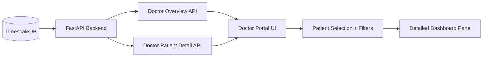

# Doctor Portal Live Monitor Architecture

## 1. Overview

This feature upgrades the Doctor Portal from a single-patient view to a dual-view clinical workspace:
- Population overview for all monitored patients at a glance.
- Detailed patient dashboard for deep triage and clinical context.

## 2. Architecture Diagram

## 3. API Design

### 3.1 Population Overview
`GET /api/doctor/overview`

Returns one row per patient with:
- demographic/profile basics
- latest vitals (heart_rate, hrv, spo2, confidence)
- latest event (type, severity, timestamp)
- 24h alert count
- computed status (`critical`, `high`, `medium`, `stable`)

### 3.2 Patient Detail
`GET /api/doctor/patients/{user_id}/detail`

Returns:
- patient + profile metadata
- latest reading + baseline window
- event distribution (24h)
- recent events list
- recent alerts list

## 4. UI Experience

### 4.1 At-a-Glance Overview
- Live counters for total monitored patients and status breakdown.
- Search and status filter for quick triage.
- Clickable patient rows with severity highlighting.

### 4.2 Detailed Dashboard
- Selected patient identity and risk profile.
- Latest vitals and confidence.
- 24h severity distribution summary.
- Recent event timeline table.
- Recent alert dispatch table.

## 5. Security and Permissions

- API stays server-side in FastAPI.
- No secret keys exposed in client code.
- Data fetch remains read-only for this portal update.

## 6. Acceptance Criteria

- Doctor portal shows all seeded patients concurrently.
- Overview supports filtering by status and searching by name/user id.
- Selecting a patient loads detailed health dashboard in the same page.
- Existing user-level APIs remain backward compatible.
