# Multi-Patient Simulation Architecture

## 1. Overview

This feature extends the demo from single-patient streaming to concurrent population simulation.

Goals:
- Simulate multiple patients at the same time.
- Assign each patient a profile (demographics, risk, primary condition).
- Generate condition-specific biosignal events (arrhythmia, hypertension, ischemia).
- Keep all generated readings compatible with the existing ingestion -> AI -> anomaly -> alert pipeline.

## 2. Data Flow

```mermaid
flowchart LR
    Profiles[Patient Profiles JSON] --> Simulator[Population Edge Simulator]
    Simulator --> Ingestion[Ingestion Service]
    Ingestion --> KafkaRaw[biosignal.raw]
    KafkaRaw --> AI[AI Analysis Engine]
    AI --> KafkaClassified[biosignal.classified]
    KafkaClassified --> Anomaly[Anomaly Engine]
    Anomaly --> KafkaAlerts[cardiac.anomaly]
    KafkaAlerts --> Dispatch[Alert Dispatch Service]
    Dispatch --> Gateway[Notification Gateway]
    Gateway --> API[Demo API + Dashboards]
```

## 3. Profile Schema

Each simulated patient profile includes:
- user_id
- device_id
- name
- age
- subscription_tier
- risk_level
- primary_condition
- anomaly_every (cadence for condition event injection)
- home location

## 4. Database Additions

Add table:
- patient_profiles (1:1 with users)

Seed multiple users + devices + patient_profiles for deterministic demo startup.

## 5. Simulation Logic

For each profile on every simulation cycle:
- Generate baseline reading.
- If sequence % anomaly_every == 0, emit condition-specific event pattern.

Condition patterns:
- Arrhythmia: high HR variability, low HRV, intermittent low SpO2.
- Hypertension: elevated HR and high PPG proxy with mostly normal SpO2.
- Ischemia: lower SpO2 and elevated ECG proxy with moderate tachycardia.

## 6. API Visibility

Add endpoint:
- GET /api/demo/patient-profiles

Returns profile metadata and latest event snapshot per user to support live demos.

## 7. Acceptance Criteria

- At least 5 simulated patients stream concurrently.
- At least 3 event types are observed over time (arrhythmia, hypertension, ischemia).
- Dashboards and alert endpoints continue to work without contract changes.
- docker compose up --build succeeds from clean state.
